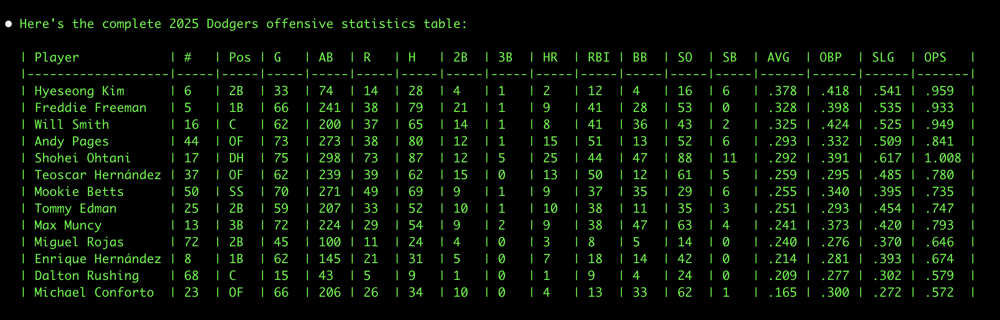

# baseball-mcp

MCP (Model Context Protocol) Server for Major League Baseball Data.

## Overview

This MCP server provides comprehensive access to MLB data through the official MLB Stats API. It allows you to search for players, teams, view schedules, check standings, and access live game data.

## Features

### Player Data
- Search for MLB players by name (active and retired)
- Retrieve detailed player information by ID
- Get comprehensive player statistics (career, season, game logs)
- Access batting, pitching, and fielding statistics

### Team Data
- Search and browse all MLB teams
- Get detailed team information
- View team rosters (active, 40-man, full season)
- Access team statistics and historical data

### Game Data
- View game schedules with date filtering
- Get detailed game information and boxscores
- Access live game feeds for ongoing games
- Check game status and scores

### Standings
- View current league standings
- Access division standings
- Check wildcard standings

## Installation

This project uses `uv` for Python package management. To install:

```bash
# Clone the repository
git clone https://github.com/yourusername/baseball-mcp.git
cd baseball-mcp

# Install dependencies with uv
uv sync
```

## Usage

### Running the MCP Server

```bash
uv run src/baseball_mcp_server.py
```

### Available Tools

#### `search_player`
Search for MLB players by name.

**Parameters:**
- `search_str` (string, required): Name of player to search for

**Example:**
```json
{
  "tool": "search_player",
  "arguments": {
    "search_str": "Jose Altuve"
  }
}
```

#### `get_player`
Get detailed information about a specific MLB player.

**Parameters:**
- `person_id` (integer, required): Unique Player Identifier
- `season` (string, optional): Season of play
- `accent` (boolean, optional): Include accent marks in names (default: true)

**Example:**
```json
{
  "tool": "get_player",
  "arguments": {
    "person_id": 514888,
    "season": "2024"
  }
}
```

#### `get_player_stats`
Get statistics for a specific MLB player.

**Parameters:**
- `person_id` (integer, required): Unique Player Identifier
- `stats` (string, required): Type of statistics (e.g., 'season', 'career', 'yearByYear', 'gameLog')
- `season` (string, optional): Season of play
- `sport_id` (integer, optional): Sport ID (default: 1 for MLB)
- `group` (string, optional): Stat group (e.g., 'hitting', 'pitching', 'fielding')

**Example:**
```json
{
  "tool": "get_player_stats",
  "arguments": {
    "person_id": 514888,
    "stats": "season",
    "season": "2024",
    "group": "hitting"
  }
}
```

#### `search_teams`
Search for MLB teams.

**Parameters:**
- `season` (string, optional): Season of play
- `sport_id` (integer, optional): Sport ID (default: 1 for MLB)
- `active_status` (string, optional): 'Y' for active, 'N' for inactive, 'B' for both (default: 'Y')
- `league_id` (integer, optional): League ID (103 for AL, 104 for NL)
- `division_id` (integer, optional): Division ID

**Example:**
```json
{
  "tool": "search_teams",
  "arguments": {
    "season": "2024",
    "league_id": 103
  }
}
```

#### `get_team`
Get detailed information about a specific MLB team.

**Parameters:**
- `team_id` (integer, required): Unique Team Identifier
- `season` (string, optional): Season of play

**Example:**
```json
{
  "tool": "get_team",
  "arguments": {
    "team_id": 117
  }
}
```

#### `get_team_roster`
Get roster for a specific MLB team.

**Parameters:**
- `team_id` (integer, required): Unique Team Identifier
- `roster_type` (string, optional): Type of roster (default: 'active')
- `season` (string, optional): Season of play
- `date` (string, optional): Specific date (format: 'YYYY-MM-DD')

**Example:**
```json
{
  "tool": "get_team_roster",
  "arguments": {
    "team_id": 117,
    "roster_type": "40Man"
  }
}
```

#### `get_schedule`
Get MLB game schedule.

**Parameters:**
- `sport_id` (integer, optional): Sport ID (default: 1 for MLB)
- `season` (string, optional): Season of play
- `start_date` (string, optional): Start date (format: 'YYYY-MM-DD')
- `end_date` (string, optional): End date (format: 'YYYY-MM-DD')
- `team_id` (integer, optional): Filter by specific team
- `game_type` (string, optional): Type of games (e.g., 'R' for regular season)

**Example:**
```json
{
  "tool": "get_schedule",
  "arguments": {
    "start_date": "2024-07-01",
    "end_date": "2024-07-07",
    "team_id": 117
  }
}
```

#### `get_game_info`
Get detailed information about a specific game.

**Parameters:**
- `game_pk` (integer, required): Unique Primary Key representing a game

**Example:**
```json
{
  "tool": "get_game_info",
  "arguments": {
    "game_pk": 717676
  }
}
```

#### `get_standings`
Get league standings.

**Parameters:**
- `league_id` (integer, required): League ID (103 for AL, 104 for NL)
- `season` (string, optional): Season of play
- `standings_type` (string, optional): Type of standings (default: 'regularSeason')
- `date` (string, optional): Specific date (format: 'YYYY-MM-DD')

**Example:**
```json
{
  "tool": "get_standings",
  "arguments": {
    "league_id": 103,
    "season": "2024"
  }
}
```

#### `get_live_game_feed`
Get live feed data for an ongoing game.

**Parameters:**
- `game_pk` (integer, required): Unique Primary Key representing a game

**Example:**
```json
{
  "tool": "get_live_game_feed",
  "arguments": {
    "game_pk": 717676
  }
}
```

## Requirements

- Python 3.12+
- `uv` package manager
- Dependencies listed in `pyproject.toml`

## Development

The project structure:
```
baseball-mcp/
├── src/
│   ├── baseball_mcp_server.py  # Main MCP server implementation
│   └── data_utils.py          # Utilities for interacting with MLB Stats API
├── test/
│   └── test_dodgers_stats.py  # Example test script
├── pyproject.toml             # Project configuration and dependencies
├── README.md                  # User documentation
└── CLAUDE.md                  # Developer documentation
```

## Examples



## API Reference

This server uses the official MLB Stats API (statsapi.mlb.com) to retrieve player data.
