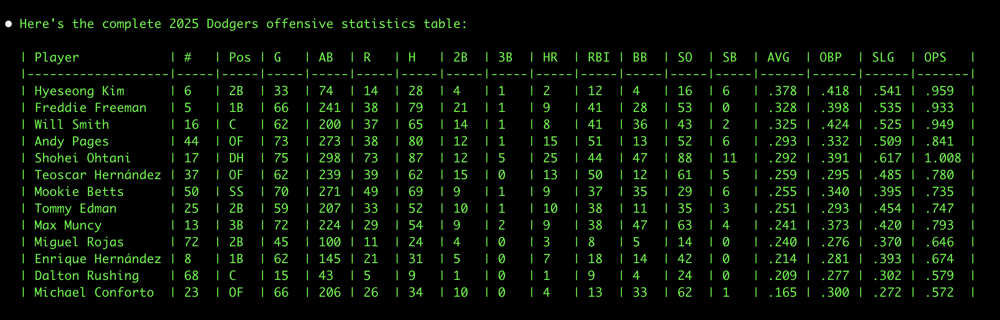
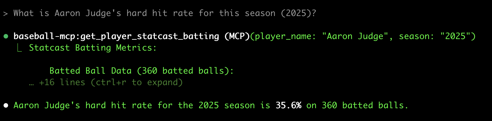
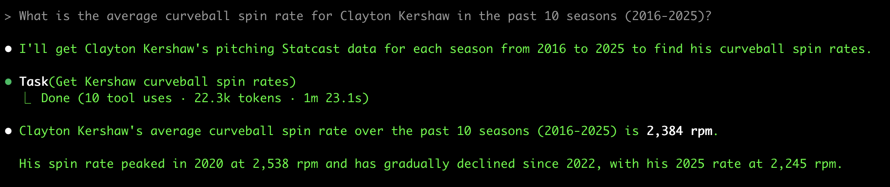
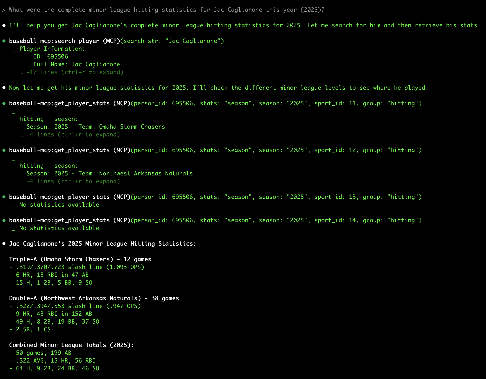

# baseball-mcp

MCP (Model Context Protocol) Server for Major League Baseball and Minor League Baseball Data.

## Overview

This MCP server provides comprehensive access to MLB, Minor League Baseball, and Nippon Professional Baseball (NPB) data through official APIs and web scraping. It allows you to search for players, teams, view schedules, check standings, and access game data across all levels of professional baseball including Triple-A, Double-A, High-A, Single-A, Rookie leagues, and Japanese professional baseball.

## Features

### Player Data

- Search for players by name (active and retired, across all levels)
- Retrieve detailed player information by ID
- Get comprehensive player statistics for MLB and Minor Leagues (career, season, game logs)
- Access batting, pitching, and fielding statistics
- **NEW: Get Statcast batting metrics** (exit velocity, launch angle, barrel rate) - MLB only
- **NEW: Get Statcast pitching metrics** (spin rate, velocity, pitch movement) - MLB only

### Team Data

- Search and browse teams from MLB and all Minor League levels
- Get detailed team information
- View team rosters (active, 40-man, full season)
- Access team statistics and historical data

### Game Data

- View game schedules for any league level with date filtering
- Get detailed game information and boxscores (MLB and Minor Leagues)
- Access live game feeds for ongoing games (MLB only)
- Check game status and scores

### Standings

- View current league standings (MLB only)
- Access division standings
- Check wildcard standings

### Minor League Support

- **NEW: Full support for Minor League data** including:
  - Triple-A (AAA)
  - Double-A (AA)
  - High-A (A+)
  - Single-A (A)
  - Rookie (R)
- Get available sports/leagues with their IDs
- Access player stats, team rosters, and schedules for all minor league levels

### NPB (Japanese Baseball) Support

- **NEW: Nippon Professional Baseball integration** featuring:
  - Player search across Central and Pacific leagues
  - Team information for all 12 NPB teams
  - Player statistics (traditional and advanced metrics)
  - Japanese name search with romanization support
  - **Smart player selection**: Automatically finds the correct player with NPB stats
  - Multi-source data aggregation:
    - **Baseball Reference**: Historical data (1936-present) for all NPB players
    - **NPB Official**: Current rosters and recent stats (2008-present)
  - **Historical Coverage**: Full career stats for legends like Sadaharu Oh (868 HRs)
  
#### Notable NPB Players Available:
- **Legends**: Sadaharu Oh, Shigeo Nagashima, Katsuya Nomura, Isao Harimoto
- **MLB Crossovers**: Ichiro Suzuki, Shohei Ohtani, Hideki Matsui, Yu Darvish, Hideo Nomo
- **Current Stars**: Munetaka Murakami, Tetsuto Yamada, Yoshinobu Yamamoto
- **Complete career statistics** including year-by-year breakdowns

## Installation

This project uses `uv` for Python package management. To install:

```bash
# Clone the repository
git clone https://github.com/yourusername/baseball-mcp.git
cd baseball-mcp

# Install dependencies with uv
uv sync

# Install the package in editable mode (for development)
uv pip install -e .
```

### Global Installation (Recommended for Claude Code)

To make the baseball-mcp server available globally across all Claude Code instances:

```bash
# From the baseball-mcp directory, install globally
uv tool install .

# Add the MCP server to Claude Code at user scope
claude mcp add baseball-mcp -s user -- baseball-mcp
```

After global installation, the `baseball-mcp` command will be available system-wide, and Claude Code will be able to use it from any directory.

## Usage

### Running the MCP Server

If installed globally:

```bash
baseball-mcp
```

Or run directly from source:

```bash
uv run src/baseball_mcp_server.py
```

### Available Tools

#### `get_available_sports`

Get list of all available sports/leagues in the MLB Stats API.

**Parameters:** None

**Example:**

```json
{
  "tool": "get_available_sports",
  "arguments": {}
}
```

#### `search_player`

Search for baseball players by name (across all levels).

**Parameters:**

- `search_str` (string, required): Name of player to search for
- `sport_id` (integer, optional): Sport ID (1 for MLB/MiLB, 31 for NPB)

**Example:**

```json
{
  "tool": "search_player",
  "arguments": {
    "search_str": "Jose Altuve"
  }
}
```

**NPB Example:**

```json
{
  "tool": "search_player",
  "arguments": {
    "search_str": "Munetaka Murakami",
    "sport_id": 31
  }
}
```

#### `get_player`

Get detailed information about a specific MLB player.

**Parameters:**

- `person_id` (integer, required): Unique Player Identifier
- `season` (string, optional): Season of play
- `accent` (boolean, optional): Include accent marks in names (default: true)

**Example:**

```json
{
  "tool": "get_player",
  "arguments": {
    "person_id": 514888,
    "season": "2024"
  }
}
```

#### `get_player_stats`

Get statistics for a specific player (MLB, Minor Leagues, or NPB).

**Parameters:**

- `person_id` (integer/string, required): Unique Player Identifier (int for MLB/MiLB, string for NPB)
- `stats` (string, required): Type of statistics (e.g., 'season', 'career', 'yearByYear', 'gameLog')
- `season` (string, optional): Season of play
- `sport_id` (integer, optional): Sport ID - Use 1 for MLB (default), or:
  - 11: Triple-A (AAA)
  - 12: Double-A (AA)
  - 13: High-A (A+)
  - 14: Single-A (A)
  - 16: Rookie (R)
  - 31: NPB (Nippon Professional Baseball)
- `group` (string, optional): Stat group (e.g., 'hitting', 'pitching', 'fielding')

**Example:**

```json
{
  "tool": "get_player_stats",
  "arguments": {
    "person_id": 514888,
    "stats": "season",
    "season": "2024",
    "group": "hitting"
  }
}
```

#### `search_teams`

Search for baseball teams (MLB, Minor Leagues, or NPB).

**Parameters:**

- `season` (string, optional): Season of play
- `sport_id` (integer, optional): Sport ID - Use 1 for MLB (default), or:
  - 11-14, 16: Minor league IDs
  - 31: NPB (returns all 12 teams)
- `active_status` (string, optional): 'Y' for active, 'N' for inactive, 'B' for both (default: 'Y')
- `league_id` (integer, optional): League ID (103 for AL, 104 for NL) - MLB only
- `division_id` (integer, optional): Division ID

**Example:**

```json
{
  "tool": "search_teams",
  "arguments": {
    "season": "2024",
    "league_id": 103
  }
}
```

#### `get_team`

Get detailed information about a specific MLB team.

**Parameters:**

- `team_id` (integer, required): Unique Team Identifier
- `season` (string, optional): Season of play

**Example:**

```json
{
  "tool": "get_team",
  "arguments": {
    "team_id": 117
  }
}
```

#### `get_team_roster`

Get roster for a specific MLB team.

**Parameters:**

- `team_id` (integer, required): Unique Team Identifier
- `roster_type` (string, optional): Type of roster (default: 'active')
- `season` (string, optional): Season of play
- `date` (string, optional): Specific date (format: 'YYYY-MM-DD')

**Example:**

```json
{
  "tool": "get_team_roster",
  "arguments": {
    "team_id": 117,
    "roster_type": "40Man"
  }
}
```

#### `get_schedule`

Get MLB game schedule.

**Parameters:**

- `sport_id` (integer, optional): Sport ID (default: 1 for MLB)
- `season` (string, optional): Season of play
- `start_date` (string, optional): Start date (format: 'YYYY-MM-DD')
- `end_date` (string, optional): End date (format: 'YYYY-MM-DD')
- `team_id` (integer, optional): Filter by specific team
- `game_type` (string, optional): Type of games (e.g., 'R' for regular season)

**Example:**

```json
{
  "tool": "get_schedule",
  "arguments": {
    "start_date": "2024-07-01",
    "end_date": "2024-07-07",
    "team_id": 117
  }
}
```

#### `get_game_info`

Get detailed information about a specific game.

**Parameters:**

- `game_pk` (integer, required): Unique Primary Key representing a game

**Example:**

```json
{
  "tool": "get_game_info",
  "arguments": {
    "game_pk": 717676
  }
}
```

#### `get_standings`

Get league standings.

**Parameters:**

- `league_id` (integer, required): League ID (103 for AL, 104 for NL)
- `season` (string, optional): Season of play
- `standings_type` (string, optional): Type of standings (default: 'regularSeason')
- `date` (string, optional): Specific date (format: 'YYYY-MM-DD')

**Example:**

```json
{
  "tool": "get_standings",
  "arguments": {
    "league_id": 103,
    "season": "2024"
  }
}
```

#### `get_live_game_feed`

Get live feed data for an ongoing game.

**Parameters:**

- `game_pk` (integer, required): Unique Primary Key representing a game

**Example:**

```json
{
  "tool": "get_live_game_feed",
  "arguments": {
    "game_pk": 717676
  }
}
```

#### `get_player_statcast_batting`

Get Statcast batting metrics for a player including exit velocity, launch angle, and barrel rate.

**Parameters:**

- `player_name` (string, required): Full name of the player (e.g., "Aaron Judge")
- `start_date` (string, optional): Start date in YYYY-MM-DD format
- `end_date` (string, optional): End date in YYYY-MM-DD format
- `season` (string, optional): Season year (e.g., "2024")

**Example:**

```json
{
  "tool": "get_player_statcast_batting",
  "arguments": {
    "player_name": "Aaron Judge",
    "season": "2024"
  }
}
```

**Returns:**

- Average and max exit velocity
- Launch angle statistics
- Barrel rate and hard hit rate
- Expected batting average (xBA) and wOBA
- Pitch type breakdown

#### `get_player_statcast_pitching`

Get Statcast pitching metrics for a player including spin rate, velocity, and pitch movement.

**Parameters:**

- `player_name` (string, required): Full name of the player (e.g., "Gerrit Cole")
- `start_date` (string, optional): Start date in YYYY-MM-DD format
- `end_date` (string, optional): End date in YYYY-MM-DD format
- `season` (string, optional): Season year (e.g., "2024")

**Example:**

```json
{
  "tool": "get_player_statcast_pitching",
  "arguments": {
    "player_name": "Gerrit Cole",
    "season": "2024"
  }
}
```

**Returns:**

- Pitch velocity (average and max) by pitch type
- Spin rate by pitch type
- Pitch movement (horizontal and vertical break)
- Pitch usage percentages
- Whiff rate

## Requirements

- Python 3.12+
- `uv` package manager
- Dependencies listed in `pyproject.toml`

## Development

The project structure:

```
baseball-mcp/
├── src/
│   ├── baseball_mcp_server.py  # Main MCP server implementation
│   ├── mlb_stats_api.py       # MLB Stats API client functions
│   ├── statcast_api.py        # Statcast/pybaseball client functions
│   ├── data_utils.py          # Utilities for formatting MLB data
│   └── cache_utils.py         # Caching mechanism for API responses
├── test/
│   ├── test_dodgers_stats.py  # Example test script
│   ├── test_statcast.py       # Statcast tools test script
│   ├── test_mlb_stats_api.py  # Unit tests for MLB Stats API
│   └── test_statcast_api.py   # Unit tests for Statcast API
├── pyproject.toml             # Project configuration and dependencies
├── README.md                  # User documentation
└── CLAUDE.md                  # Developer documentation
```

## Examples

### Minor League Examples

#### Get Available Sports/Leagues
```json
{
  "tool": "get_available_sports",
  "arguments": {}
}
```

#### Get Triple-A Teams
```json
{
  "tool": "search_teams",
  "arguments": {
    "sport_id": 11
  }
}
```

#### Get Minor League Player Stats
```json
{
  "tool": "get_player_stats",
  "arguments": {
    "person_id": 702616,
    "stats": "season",
    "sport_id": 11,
    "season": "2024"
  }
}
```
*Note: This example gets Jackson Holliday's Triple-A stats*

#### Get Double-A Schedule
```json
{
  "tool": "get_schedule",
  "arguments": {
    "sport_id": 12,
    "start_date": "2024-06-01",
    "end_date": "2024-06-07"
  }
}
```

### MLB Examples







### Minor League Examples



### NPB Examples

#### Get NPB Teams
```json
{
  "tool": "search_teams",
  "arguments": {
    "sport_id": 31
  }
}
```

#### Search NPB Player
```json
{
  "tool": "search_player",
  "arguments": {
    "search_str": "Murakami",
    "sport_id": 31
  }
}
```

#### Get NPB Player Stats
```json
{
  "tool": "get_player_stats",
  "arguments": {
    "person_id": "npb_munetaka_murakami_2024",
    "stats": "batting",
    "sport_id": 31,
    "season": "2024"
  }
}
```

#### Get Historical NPB Stats (Legends)
```json
{
  "tool": "search_player",
  "arguments": {
    "search_str": "Sadaharu Oh",
    "sport_id": 31
  }
}
```

Then get their career stats:
```json
{
  "tool": "get_player_stats",
  "arguments": {
    "person_id": "br_oh----000sad",
    "stats": "batting",
    "sport_id": 31
  }
}
```

#### Get NPB Stats for MLB Players
Search for players who played in both leagues:
```json
{
  "tool": "search_player",
  "arguments": {
    "search_str": "Ichiro Suzuki",
    "sport_id": 31
  }
}
```

## Caching

The server implements a file-based caching mechanism to improve performance:

- Statcast data is cached for 24 hours by default
- Cache files are stored in a `.cache` directory
- Subsequent requests for the same data will be served from cache

## API Reference

This server uses:

- **MLB Stats API** (statsapi.mlb.com) for player, team, and game data
- **Baseball Savant** (via pybaseball) for Statcast metrics including exit velocity, launch angle, and spin rate
- **NPB Official Site** (npb.jp) for Japanese baseball statistics (2008-present)
